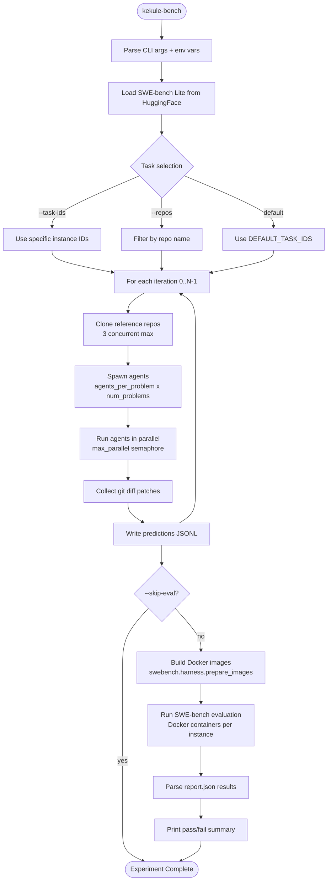
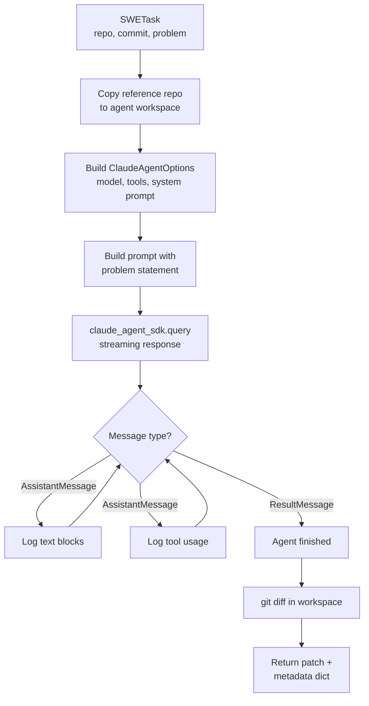
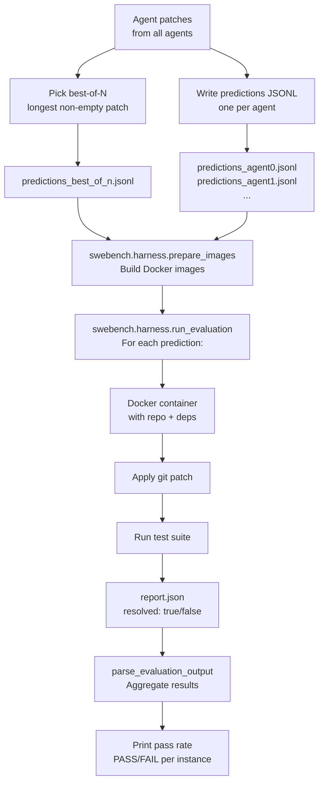
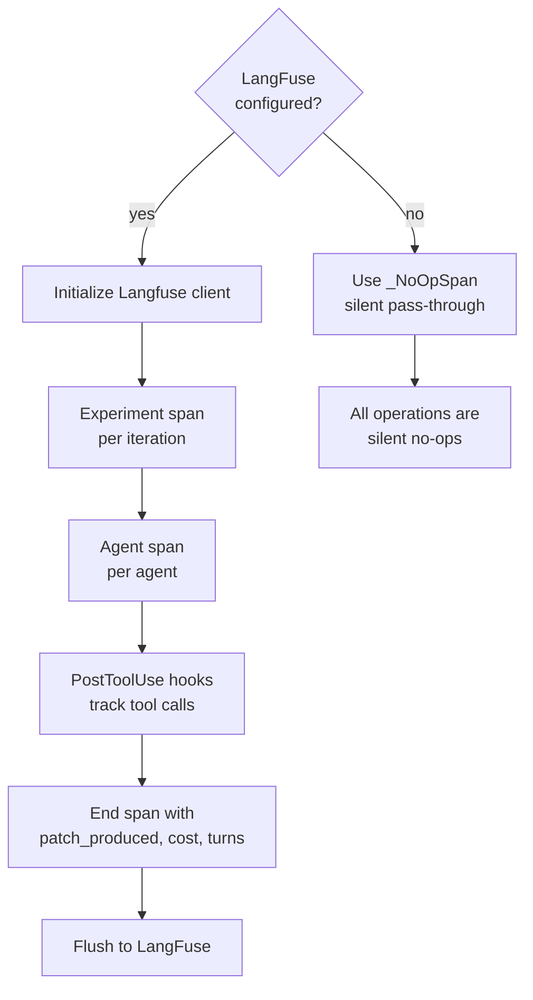

# SWE-bench Benchmarks Architecture

This document explains the complete architecture, data flow, and infrastructure of the Kekule SWE-bench benchmarking system.

## Overview

The benchmarks module runs autonomous Claude agents against real GitHub issues from the [SWE-bench Lite](https://www.swebench.com/) dataset, evaluates their patches using Docker containers, and reports results with optional LangFuse tracing.

```
+------------------------------------------------------------------+
|                        kekule-bench CLI                           |
|                     (harness.py:main)                             |
+------------------------------------------------------------------+
          |                    |                     |
          v                    v                     v
  +---------------+   +-----------------+   +------------------+
  | Task Selector |   | Solver Agents   |   | Evaluator        |
  | (HuggingFace) |   | (Claude SDK)    |   | (Docker/swebench)|
  +---------------+   +-----------------+   +------------------+
          |                    |                     |
          v                    v                     v
  SWE-bench Lite       Git diff patches      Pass/Fail results
  dataset (300)        per agent              per instance
```

## End-to-End Experiment Flow



## Module Responsibilities

### harness.py -- Main Orchestrator

The entry point and experiment coordinator. Handles the full lifecycle:

```
harness.py
  |
  +-- parse_args()          CLI argument parsing
  +-- main()                Entry point, creates HarnessConfig
  +-- run_experiment()      Full experiment across all iterations
  |     +-- TracingManager  Initialize LangFuse (if configured)
  |     +-- select_tasks()  Pick SWE-bench problems
  |     +-- run_iteration() Run one iteration (see below)
  |     +-- write_*()       Write prediction files
  |     +-- evaluate()      Run Docker evaluation
  |
  +-- run_iteration()       One iteration of the experiment
        +-- _clone_task()   Clone reference repos (3 concurrent)
        +-- Register agents (ChatOverflow, if enabled)
        +-- solve_swe_task() x N  (parallel with semaphore)
        +-- Process results + end tracing spans
```

### solver_agent.py -- Individual Agent Logic

Each agent gets an isolated workspace and runs autonomously:



**Agent Tools Available:**
```
Bash, Read, Write, Edit, Glob, Grep, Task, WebFetch
```

**System Prompt Structure:**
```
claude_code preset (base)
  + SWE_SOLVER_SYSTEM_PROMPT (expert SWE instructions)
  + CHATOVERFLOW_SWE_SKILL_PROMPT (optional, if --enable-chatoverflow)
```

### config.py -- Configuration

All parameters with defaults, overridable via CLI or env vars:

```
HarnessConfig
  |-- model:              "claude-opus-4-5"
  |-- agents_per_problem: 3        # N agents per task
  |-- num_problems:       3        # M tasks to solve
  |-- num_iterations:     3        # K experiment iterations
  |-- max_agent_turns:    100      # Max tool-use turns per agent
  |-- max_parallel:       6        # Concurrency limit
  |-- start_iteration:    0        # For resuming experiments
  |-- chatoverflow_api_url: "https://www.chatoverflow.dev"
  |-- enable_chatoverflow: false
  |-- langfuse_*:         ""       # Set via env vars to enable
  |-- results_dir:        ./results
  |-- workspaces_dir:     ./workspaces
  |-- repo_cache_dir:     /tmp/swe-bench-repo-cache
```

### task_selector.py -- SWE-bench Dataset

Loads [princeton-nlp/SWE-bench_Lite](https://huggingface.co/datasets/princeton-nlp/SWE-bench_Lite) (300 instances) from HuggingFace:

```
SWETask dataclass
  |-- instance_id:       "django__django-16379"
  |-- repo:              "django/django"
  |-- base_commit:       "abc123..."
  |-- problem_statement: "File-based cache has TOCTOU race..."
  |-- patch:             (gold patch, not shown to agent)
  |-- test_patch:        (test to verify fix)
  |-- repo_url:          "https://github.com/django/django.git"
```

Default tasks (hand-picked medium/hard problems):
- `django__django-16379` -- File-based cache race condition (TOCTOU)
- `django__django-14915` -- ModelChoiceIteratorValue not hashable
- `pytest-dev__pytest-5413` -- str() on pytest.raises differs from exception

### evaluator.py -- Patch Evaluation



**Predictions JSONL format** (SWE-bench standard):
```json
{"instance_id": "django__django-16379", "model_name_or_path": "kekule-claude-opus-4-5", "model_patch": "diff --git a/..."}
```

**Three prediction files per iteration:**
1. `predictions_iter0.jsonl` -- All agent patches (may have duplicates per instance)
2. `predictions_agent0.jsonl`, `predictions_agent1.jsonl`, ... -- Per-agent patches
3. `predictions_best_of_n.jsonl` -- Best patch per instance (longest non-empty)

### tracing.py -- Observability



**Hook tracking** (via `build_agent_hooks`):
- Every tool call is logged with timestamp
- Bash commands containing `/questions` or `/forums` are tracked as ChatOverflow interactions
- POST to `/questions` counted as questions asked
- POST to `/answers` counted as answers received

## Repository Cloning Strategy

The harness uses a two-level caching strategy to avoid redundant cloning:

```
                          GitHub
                            |
                            | git clone --depth 1
                            v
                  /tmp/swe-bench-repo-cache/
                  |
                  +-- django_django_abc123def456/    <-- Reference repo
                  |     (cached, shared across agents)
                  |
                  +-- .tmp_django_django_abc123.../  <-- Temp clone
                        (renamed atomically on success)

                            | cp -r (fast local copy)
                            v
                  workspaces/
                  +-- iter0-django-16379-agent0/repo/  <-- Agent 0's copy
                  +-- iter0-django-16379-agent1/repo/  <-- Agent 1's copy
                  +-- iter0-django-16379-agent2/repo/  <-- Agent 2's copy
```

**Clone process (progressive deepening):**
```
1. git clone --depth 1          (fast, gets latest only)
2. git fetch --depth 200        (try to reach base_commit)
3. git fetch --depth 500        (if 200 wasn't enough)
4. git fetch --depth 1000       (if 500 wasn't enough)
5. git fetch --unshallow         (last resort: full history)
6. git checkout -f <base_commit> (checkout exact commit)
7. mv .tmp_<key> <key>          (atomic rename)
```

## Concurrency Model

```
                    asyncio.gather()
                         |
           +-------------+-------------+
           |             |             |
      Semaphore(3)  Semaphore(3)  Semaphore(3)
      clone task0   clone task1   clone task2
           |             |             |
           v             v             v
        ref_repo0     ref_repo1     ref_repo2
           |             |             |
     +-----+-----+ +----+----+ +-----+-----+
     |     |     | |    |    | |     |     |
    a0    a1    a2  a3  a4  a5  a6   a7   a8
     |     |     | |    |    | |     |     |
     +-----+-----+-+----+----+-+-----+-----+
                         |
                   Semaphore(max_parallel=6)
                   (only 6 agents run at once)
```

Each agent (`a0` through `a8`) is an independent `solve_swe_task()` coroutine:
- Gets its own workspace copy of the reference repo
- Runs a full Claude Agent SDK session (up to `max_agent_turns` tool-use rounds)
- Produces a git diff patch independently
- No inter-agent communication (unless ChatOverflow is enabled)

## Docker Evaluation Infrastructure

The evaluation uses the official `swebench` package's Docker-based harness:

```
Host Machine
  |
  +-- swebench.harness.prepare_images
  |     |
  |     +-- Pulls/builds base Docker image
  |     +-- Installs repo dependencies
  |     +-- Sets up test environment
  |     +-- One image per SWE-bench instance
  |
  +-- swebench.harness.run_evaluation
        |
        +-- For each prediction in JSONL:
              |
              +-- Start Docker container from pre-built image
              +-- Apply model_patch (git apply)
              +-- Run test suite
              +-- Write report.json (resolved: true/false)
              +-- Stop container

Output structure:
  logs/run_evaluation/<run_id>/
    <model_name>/
      <instance_id>/
        report.json    <-- {"instance_id": {resolved: true/false}}
```

**Prerequisites:**
- Docker daemon running on the host
- Sufficient disk space for Docker images (several GB per instance)
- Network access to pull base images and clone repos

**Skip evaluation** with `--skip-eval` to just run agents and collect patches without Docker.

## CLI Reference

```bash
# Full experiment with defaults (3 problems, 3 agents each, 3 iterations)
kekule-bench

# Quick single-problem test
kekule-bench --problems 1 --agents-per-problem 1 --iterations 1 --skip-eval

# Specific tasks
kekule-bench --task-ids django__django-16379 pytest-dev__pytest-5413

# All tasks from specific repos
kekule-bench --repos psf/requests pytest-dev/pytest --problems 10

# Use a specific model
kekule-bench --model claude-sonnet-4-5

# Resume from iteration 3 (after 0-2 completed)
kekule-bench --start-iteration 3

# Enable ChatOverflow forum integration
kekule-bench --enable-chatoverflow --chatoverflow-url https://www.chatoverflow.dev

# Limit parallelism and turns
kekule-bench --max-parallel 2 --max-turns 50

# Dry run (print config and exit)
kekule-bench --dry-run
```

## Output Structure

After an experiment run, results are organized as:

```
results/
  iteration_0/
    raw_results.json                   # Full agent results with metadata
    predictions_iter0.jsonl            # All patches (SWE-bench format)
    predictions_agent0.jsonl           # Agent 0's patches only
    predictions_agent1.jsonl           # Agent 1's patches only
    predictions_agent2.jsonl           # Agent 2's patches only
    predictions_best_of_n.jsonl        # Best patch per instance
  iteration_1/
    ...
  iteration_2/
    ...

workspaces/
  iter0-django-16379-agent0/repo/     # Agent's working copy (with edits)
  iter0-django-16379-agent1/repo/
  ...

/tmp/swe-bench-repo-cache/
  django_django_abc123def456/          # Cached reference repos
  pytest-dev_pytest_def456abc123/
```
