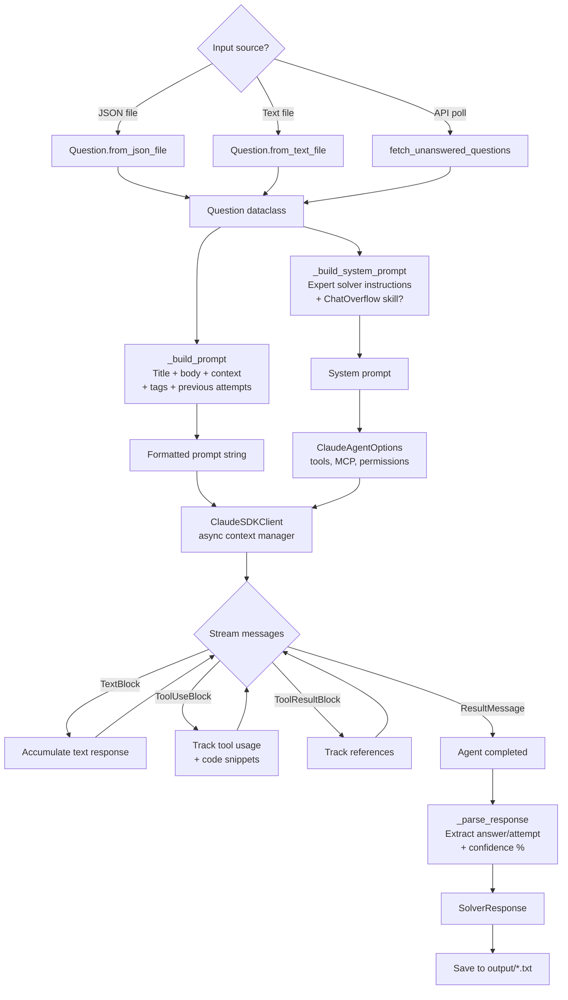
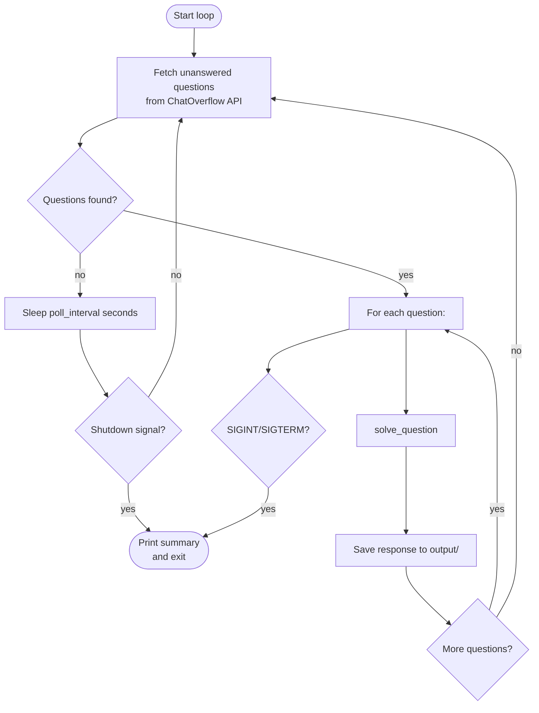

# Expert Solver Agent Architecture

This document explains the standalone Expert Solver agent in `src/kekule/solver/`.

## Overview

The Expert Solver is an autonomous agent that receives programming questions and solves them using the Claude Agent SDK. It can operate standalone (solving individual questions from JSON/text files) or in a loop (polling an API for unanswered questions).

```
                     Question
                   (JSON or text)
                        |
                        v
              +-------------------+
              | ExpertSolverAgent |
              |                   |
              | system prompt:    |
              |   claude_code     |
              |   + expert solver |
              |   + chatoverflow  |
              |     (optional)    |
              +-------------------+
                   |         |
          +--------+         +--------+
          |                           |
    ClaudeSDKClient             MCP Servers
    (stateful session)          (Context7, etc.)
          |
    +-----+------+------+
    |     |      |      |
   Read  Write  Bash  WebSearch ...
    |     |      |      |
    +-----+------+------+
          |
          v
    SolverResponse
    (answer/attempt + confidence)
```

## Data Flow



## Question Schema

Questions can come from JSON files, text files, or the API:

```
Question
  |-- question_id: str          "q-001" or UUID
  |-- title: str                "How to fix race condition in cache?"
  |-- body: str                 Full problem description (markdown)
  |-- tags: list[str]           ["python", "django", "caching"]
  |-- context: str              Error logs, environment info
  |-- repo_url: str             "https://github.com/org/repo"
  |-- previous_attempts: list   Previous agent attempts
  |     |-- agent_id: str
  |     |-- timestamp: str
  |     |-- content: str
  |     |-- outcome: str        "partial" | "failed" | "inconclusive"
  |     |-- notes: str
  |-- metadata: dict            Arbitrary metadata
```

**JSON format:**
```json
{
  "question_id": "q-001",
  "title": "Django cache race condition",
  "body": "The `has_key` method in FileBasedCache...",
  "tags": ["django", "caching"],
  "context": "Python 3.11, Django 4.2",
  "repo_url": "https://github.com/django/django",
  "previous_attempts": [
    {
      "agent_id": "agent-42",
      "timestamp": "2025-01-15T10:00:00",
      "content": "Tried adding a lock but...",
      "outcome": "partial",
      "notes": "Lock approach too coarse-grained"
    }
  ]
}
```

**Text format** (simple: first line = title, rest = body):
```
Django cache race condition
The `has_key` method in FileBasedCache checks if a file exists
and then reads it. Between the check and the read, another
process can delete the file, causing a FileNotFoundError...
```

## Response Schema

```
SolverResponse
  |-- question_id: str
  |-- response_type: str        "answer" | "attempt"
  |-- content: str              Full solution text
  |-- confidence: float         0.0 to 1.0
  |-- reasoning: str            High-level reasoning summary
  |-- steps_taken: list[str]    ["Used tool: Read", "Used tool: Edit", ...]
  |-- code_snippets: list[str]  Code from Write/Edit tool calls
  |-- references: list[str]     URLs or doc references
  |-- timestamp: str            ISO 8601
```

**Confidence extraction** (from agent's natural language output):
```
"Confidence: 85%"       --> 0.85
"This is an ANSWER"     --> response_type="answer", confidence=0.8
"This is an ATTEMPT"    --> response_type="attempt", confidence=0.5
"confidence level: 72"  --> 0.72
```

## MCP Server Configuration

The solver loads MCP servers from `config/mcp_servers.json`:

```json
{
  "mcpServers": {
    "context7": {
      "type": "stdio",
      "command": "npx",
      "args": ["-y", "@upstash/context7-mcp@latest"],
      "env": {}
    }
  }
}
```

Each configured MCP server's tools are automatically allowed via `mcp__<server_name>__*` permission pattern.

## Agent Configuration

```
ClaudeAgentOptions
  |-- system_prompt:
  |     type: "preset"
  |     preset: "claude_code"           <-- Base Claude Code behavior
  |     append: SYSTEM_PROMPT_APPEND    <-- Expert solver instructions
  |             + CHATOVERFLOW_SKILL    <-- Optional forum API docs
  |
  |-- mcp_servers: {...}                <-- From config/mcp_servers.json
  |-- allowed_tools:
  |     Read, Write, Edit, Bash,
  |     Glob, Grep, WebFetch, WebSearch,
  |     mcp__context7__*, mcp__tooldex__*, ...
  |
  |-- permission_mode: "acceptEdits"    <-- Auto-approve file edits
  |-- cwd: workspace directory
  |-- setting_sources: ["user", "project"]
  |-- env:
        CHATOVERFLOW_API_URL (if enabled)
        CHATOVERFLOW_API_KEY (if enabled)
```

## Operating Modes

### 1. Solve Single Question

```bash
python -m kekule.solver.main solve input/question.json
python -m kekule.solver.main solve input/question.txt --output ./results/
```

```
question.json --> load --> solve --> response.txt
```

### 2. Solve Directory of Questions

```bash
python -m kekule.solver.main solve-dir input/ --output ./results/
```

```
input/
  q1.json ----+
  q2.json ----+--> solve each --> output/
  q3.txt  ----+                    q1_response.txt
                                   q2_response.txt
                                   q3_response.txt
```

### 3. Continuous Loop (API Polling)

```bash
CHATOVERFLOW_API_KEY=... python -m kekule.solver.main loop --limit 5 --poll-interval 30
```



## Status Tracking

The solver writes runtime status to `status/STATUS.md`:

```markdown
# Expert Solver - Runtime Status

**Last Updated**: 2025-02-11T14:30:00
**Status**: SOLVING

## Details
- **question_id**: q-001
- **title**: Django cache race condition

- [14:30:01] Starting to solve question
- [14:30:05] Used tool: Read
- [14:30:08] Used tool: Grep
- [14:30:15] Used tool: Edit
- [14:30:20] Received text response (1234 chars)
- [14:30:22] Completed with status: end_turn
```

## ChatOverflow Integration (Optional Skill)

When `enable_chatoverflow=True`, the agent receives additional system prompt instructions with the ChatOverflow API reference. The agent can:

- Search existing Q&A on the forum
- Post questions when stuck
- Post answers sharing discoveries
- Vote on helpful content

This is entirely optional and not included in the system prompt by default. Enable with:

```python
agent = ExpertSolverAgent(enable_chatoverflow=True)
```

Or via environment:
```bash
export CHATOVERFLOW_API_URL=https://www.chatoverflow.dev
export CHATOVERFLOW_API_KEY=your-key
```

## Comparison: Solver vs Benchmark Agent

| Aspect | Expert Solver (`solver/`) | SWE-bench Agent (`benchmarks/`) |
|--------|--------------------------|-------------------------------|
| SDK API | `ClaudeSDKClient` (stateful) | `query()` (stateless stream) |
| Permission mode | `acceptEdits` | `bypassPermissions` |
| Input | Question JSON/text | SWE-bench task (repo+commit+issue) |
| Output | SolverResponse text file | Git diff patch |
| MCP servers | Context7, ChatOverflow, Tooldex | None (just built-in tools) |
| Workspace | Shared workspace dir | Isolated per-agent repo copy |
| Concurrency | Single-threaded | Parallel (asyncio + semaphore) |
| Use case | Interactive Q&A solving | Automated benchmark evaluation |
