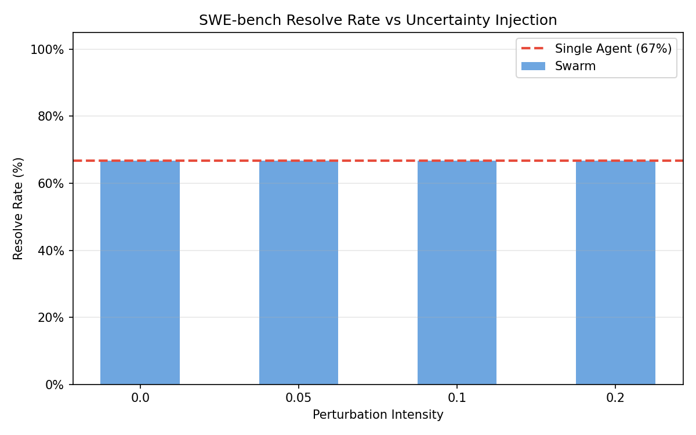
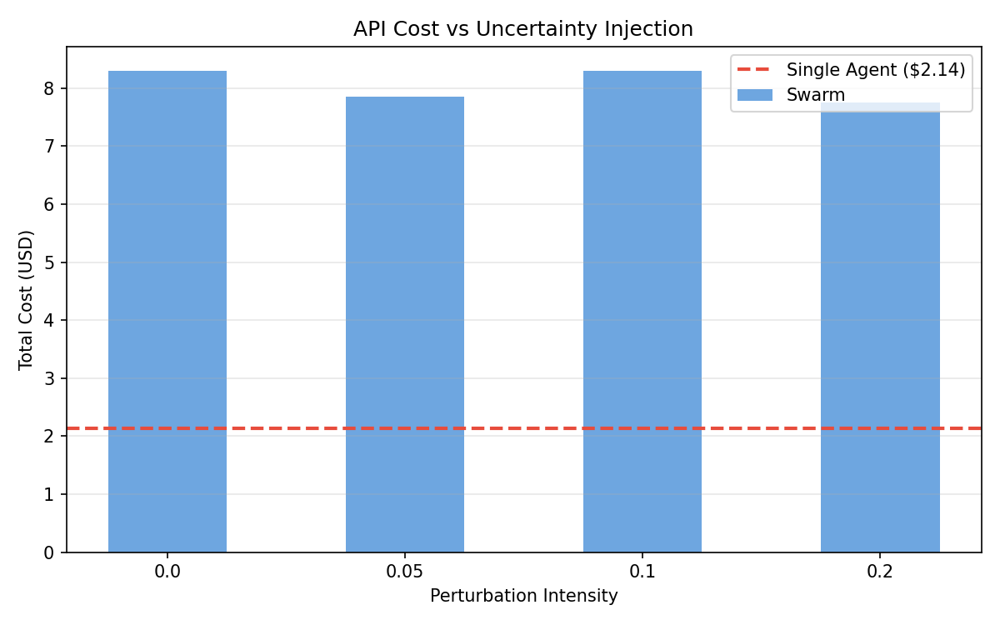
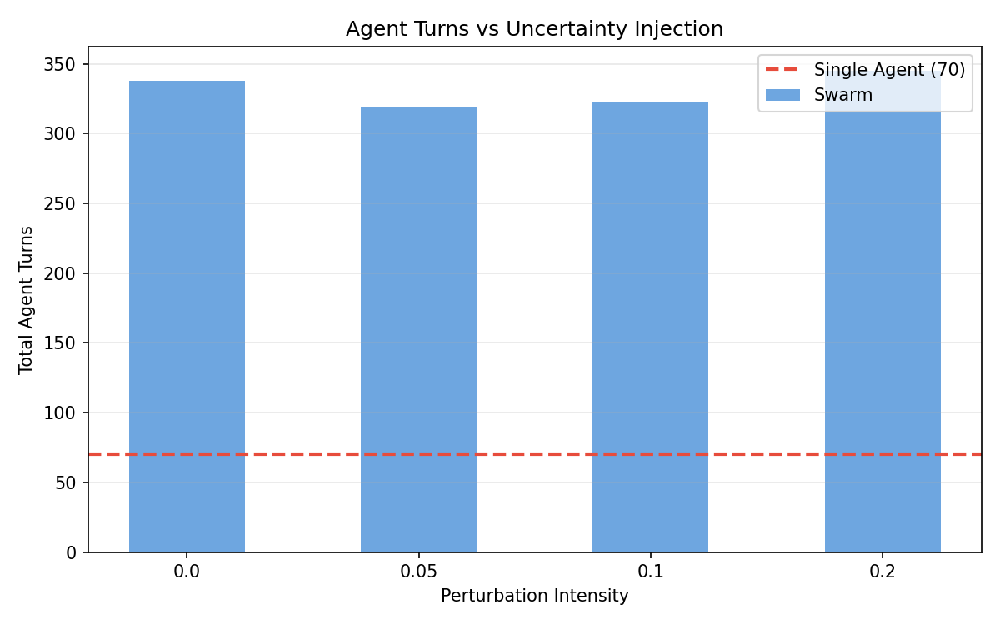
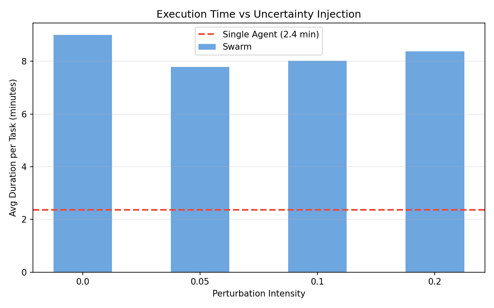
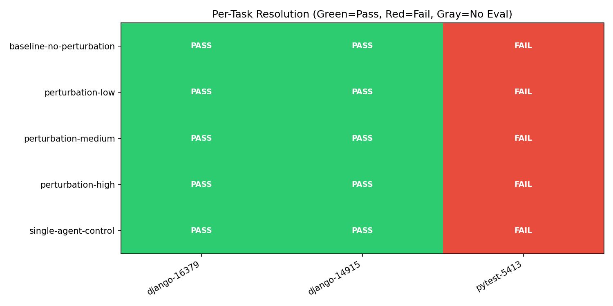
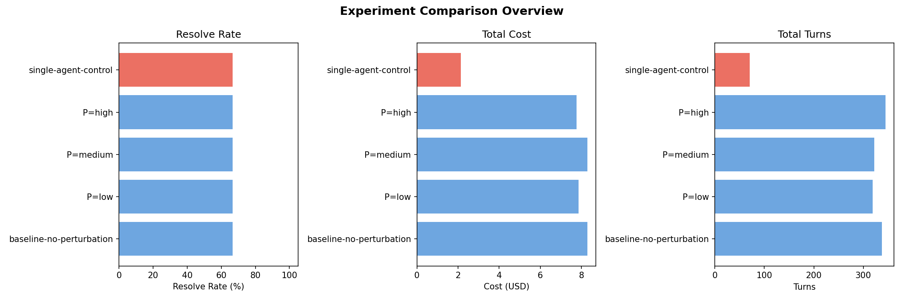

# Uncertainty Injection Experiment — Final Report

**Generated**: 2026-02-12 09:55 UTC
**Tasks**: django__django-16379, django__django-14915, pytest-dev__pytest-5413
**Experiments**: 5 (4 swarm conditions + 1 single-agent control)
**Total cost**: ~$34.35
**Total runtime**: ~93 minutes

## Perturbation Architecture

### How Perturbation Is Introduced

Perturbation is implemented as a **persistent system prompt injection** into each swarm agent. The perturbation text is interpolated into the agent's system prompt template alongside the swarm ledger protocol, role suggestion, and coordination rules.

```
kekule-bench CLI
  └── harness.py: run_experiment()
        └── perturbation_swarm.py: solve_swe_task()     ← reads PERTURBATION_INTENSITY env var
              ├── Phase 0: plan_roles()                  ← NOT perturbed (planner is clean)
              ├── Phase 1: run_swarm_agent() × N         ← perturbation injected HERE
              └── Phase 2: select_best_patch()           ← NOT perturbed (deterministic Python)
```

In `run_swarm_agent()`, the intensity float is mapped to a prompt string and inserted into the `SWARM_PROTOCOL_PROMPT` template:

```python
system_prompt = SWARM_PROTOCOL_PROMPT.format(
    agent_num=agent_num,
    num_agents=num_agents,
    role_goal=role["goal"],
    perturbation_text=perturbation_text,   # ← changes per intensity
    chatoverflow_prompt=chatoverflow_prompt,
)
```

### What Is Perturbed

Only the **swarm agents** (Phase 1) receive the uncertainty text. It appears as a `## Uncertainty Notice` section in their system prompt, visible on every turn.

### What Is Deliberately NOT Perturbed

- **The planner** (Phase 0) — only runs ~5 turns with read-only tools. Perturbing it would change role assignments, confounding the coordination analysis.
- **Patch selection** (Phase 2) — deterministic Python function that reads ledger files. No LLM involved.
- **The problem statement** — all agents see the identical GitHub issue text.
- **Tools and permissions** — all agents get the same tool set (`Bash`, `Read`, `Write`, `Edit`, `Glob`, `Grep`) regardless of intensity.

### Perturbation Intensity Ladder

The levels come from the perturbation protocol (`docs/perturbation-protocol.md`, Step 3 & 5), which models perturbations with a fire probability `p` and recommends a baseline + 3-level ladder:

| Intensity | Injected System Prompt Text |
|-----------|-----------------------------|
| 0.00 (baseline) | *(nothing added)* |
| 0.05 (low) | "Note: findings in the ledger may be incomplete. Cross-check before building on them." |
| 0.10 (medium) | "Current hypotheses (yours and others') may be wrong. Verify each claim against the code before proceeding. Check at least one alternative explanation." |
| 0.20 (high) | "Findings from other agents and your own initial analysis are likely incomplete. Before acting on any hypothesis, actively seek disconfirming evidence. Do not trust unverified claims in the ledger." |

### Design Choice: Persistent vs Probabilistic

The perturbation protocol suggests a fire probability `p` per tool call. Our implementation chose **persistent injection** — the uncertainty text is always present in the system prompt, not intermittently injected via hooks. This is a stronger perturbation than probabilistic firing because agents can't "get lucky" and miss it. Every reasoning step is influenced. The trade-off is that we can't measure per-event sensitivity, but we get a cleaner signal on whether the swarm's coordination mechanisms absorb the perturbation.

## Swarm Architecture

### Three-Phase Design

```
Phase 0: PLANNING (single query() call, ~5 turns, read-only tools)
  Input:  Problem statement
  Output: JSON array of 2-4 roles [{name, goal}, ...]
  Fallback: 3 default roles on parse failure

Phase 1: SWARM EXECUTION (N agents in parallel, SHARED workspace + ledger)
  ┌─────────────────────────────────────────────────────────┐
  │                    Shared Repo Directory                │
  │  (agents read/write the same files, see each other's   │
  │   edits in real-time)                                  │
  │                                                         │
  │  swarm_ledger/                                         │
  │  ├── agent-0/                                          │
  │  │   ├── findings.md      # Ongoing discoveries        │
  │  │   ├── hypothesis.md    # Current working theory     │
  │  │   ├── status.md        # exploring/fixing/done      │
  │  │   ├── proposed_fix.diff # Proposed patch            │
  │  │   └── verification.md  # Verification of others     │
  │  ├── agent-1/                                          │
  │  │   └── ...                                           │
  │  └── agent-N/                                          │
  │      └── ...                                           │
  └─────────────────────────────────────────────────────────┘

Phase 2: PATCH SELECTION (Python function, no agent)
  Priority: endorsed fix > single proposed fix > workspace git diff
```

### Coordination Mechanisms

1. **Live Communication** — Agents share a ledger directory. Each agent writes to its own subdirectory and reads from all others.
2. **Dynamic Coordination** — The planner suggests initial roles, but agents adapt based on what the swarm discovers. Status updates signal phase transitions.
3. **Verification / Reward** — Agents validate fixes by running tests. A fix endorsed by another agent (independent verification) is prioritized in patch selection.

## Task-Level Results

### Summary Table

| Experiment | Solver | Intensity | Resolved | Patches | Cost (USD) | Turns | Avg Time (min) |
|------------|--------|-----------|----------|---------|------------|-------|----------------|
| ansh-baseline-no-perturbation | perturbation_swarm | 0.0 | 2/3 | 3/3 | $8.30 | 338 | 9.0 |
| ansh-perturbation-low | perturbation_swarm | 0.05 | 2/3 | 3/3 | $7.86 | 319 | 7.8 |
| ansh-perturbation-medium | perturbation_swarm | 0.1 | 2/3 | 3/3 | $8.29 | 322 | 8.0 |
| ansh-perturbation-high | perturbation_swarm | 0.2 | 2/3 | 3/3 | $7.76 | 345 | 8.4 |
| ansh-single-agent-control | default | 0.0 | 2/3 | 3/3 | $2.14 | 70 | 2.4 |

### Per-Task Results

#### django__django-16379 (file-based cache TOCTOU race condition)

| Experiment | Resolved | Patch Size |
|------------|----------|------------|
| ansh-baseline-no-perturbation | PASS | 623 bytes |
| ansh-perturbation-low | PASS | 623 bytes |
| ansh-perturbation-medium | PASS | 709 bytes |
| ansh-perturbation-high | PASS | 623 bytes |
| ansh-single-agent-control | PASS | 623 bytes |

All conditions converged on the same fix: replace `os.path.exists()` + `open()` with `try: open() ... except FileNotFoundError`. The planner consistently assigned a `race_condition_analyzer` role for this task.

#### django__django-14915 (ModelChoiceIteratorValue not hashable)

| Experiment | Resolved | Patch Size |
|------------|----------|------------|
| ansh-baseline-no-perturbation | PASS | 396 bytes |
| ansh-perturbation-low | PASS | 396 bytes |
| ansh-perturbation-medium | PASS | 396 bytes |
| ansh-perturbation-high | PASS | 396 bytes |
| ansh-single-agent-control | PASS | 396 bytes |

All conditions produced identical patches: add `__hash__` method returning `hash(self.value)` to `ModelChoiceIteratorValue`.

#### pytest-dev__pytest-5413 (str() on pytest.raises context)

| Experiment | Resolved | Patch Size |
|------------|----------|------------|
| ansh-baseline-no-perturbation | FAIL | 1047 bytes |
| ansh-perturbation-low | FAIL | 1047 bytes |
| ansh-perturbation-medium | FAIL | 508 bytes |
| ansh-perturbation-high | FAIL | 508 bytes |
| ansh-single-agent-control | FAIL | 1067 bytes |

**Why this task failed across all conditions:**

The issue reports that `str()` on a `pytest.raises` context variable returns a file location string (`<console>:3: LookupError: A`) instead of the exception message (`A\nB\nC`). All agents converged on `return str(self.value)` — making `str(ExceptionInfo)` return the exception's message text. This is the literal interpretation of the issue.

However, the gold patch **deletes** `__str__` entirely, so `str()` falls through to `__repr__()` which returns `<ExceptionInfo ValueError tblen=4>`. The gold test asserts:

```python
assert str(excinfo) == "<ExceptionInfo ValueError tblen=4>"
```

The agents' fix returns `''` for a bare `ValueError()` (which has no message), failing this assertion. The correct fix is counter-intuitive — deletion rather than replacement — and requires reading the test patch (not shown to agents) to understand the expected behavior. This is a genuinely hard task where the issue description points toward one fix but the gold standard expects a different one.

## Graphs

### Resolve Rate vs Perturbation Intensity


### Cost vs Perturbation Intensity


### Agent Turns vs Perturbation Intensity


### Execution Time vs Perturbation Intensity


### Per-Task Resolution Heatmap


### Combined Overview


## Behavioral Analysis: How Perturbation Changed Agent Coordination

While task-level metrics (resolve rate, cost, turns) were stable across conditions, the **coordination dynamics shifted meaningfully**. Analysis of the swarm ledger artifacts reveals distinct behavioral patterns at each intensity level.

### Coordination Metrics from Ledger Analysis

| Metric | Baseline (0.0) | Low (0.05) | Medium (0.10) | High (0.20) |
|--------|---------------|------------|---------------|-------------|
| Findings written (lines) | 383 | 353 | **419** | **435** |
| Hypotheses posted | 5 | 3 | 5 | 5 |
| Proposed diffs | 5 | 6 | **7** | 4 |
| Verification files created | 7 | 7 | 7 | 6 |
| PASS mentions in verification | 8 | **15** | **17** | 11 |
| FAIL mentions in verification | 0 | 0 | **3** | 0 |
| Agents reaching "done" status | 6/9 | 7/9 | 7/9 | 6/9 |
| Agents stuck (exploring/fixing/verifying) | 3/9 | 2/9 | 2/9 | 3/9 |

### Key Behavioral Differences

**1. Medium perturbation (0.10) produced the most thorough verification.**
With 17 PASS mentions and 3 FAIL mentions, medium was the only condition where agents detected and reported failures in each other's work. The instruction to "verify each claim against the code" and "check at least one alternative explanation" made agents more rigorous verifiers without causing paralysis.

**2. Findings volume increased with perturbation intensity.**
Baseline agents wrote 383 lines of findings; high-perturbation agents wrote 435 lines (+14%). The uncertainty text motivated agents to document more as they cross-checked claims, producing a richer shared knowledge base even though the final patches were the same.

**3. Low perturbation (0.05) was the "just cautious enough" sweet spot.**
It had the most PASS verification mentions (15) with zero FAIL mentions — agents cross-checked more but always confirmed what they found. It also had the highest completion rate (7/9 agents reaching "done") with the lowest cost ($7.86).

**4. High perturbation (0.20) caused under-commitment.**
Only 4 proposed diffs were written (vs 5-7 in other conditions), and more agents got stuck in "verifying" or "fixing" states instead of reaching "done". The instruction to "actively seek disconfirming evidence" and "do not trust unverified claims" made agents hesitant to commit to fixes, matching the pre-experiment hypothesis about over-verification at high intensity.

**5. The planner adapted roles to the problem consistently.**
Across all conditions, the planner (which was unperturbed) consistently assigned `race_condition_analyzer` for django-16379 and `code_tracer`/`fix_implementer` for the others. Role planning was not affected by perturbation since it runs in Phase 0 before any uncertainty injection.

### Interpretation per Perturbation Protocol (Step 7)

The perturbation protocol's interpretation framework maps our results to:

> **"No change across intensities"** on task-level metrics, **with visible trajectory-level shifts** in verification density, findings volume, and commitment patterns.

The protocol says this means either:
- (a) The perturbation channel is correct but too weak, or
- (b) The verification mechanism is strong enough to absorb the perturbation

Given that verification behavior *did* change (more cross-checking at medium/high), the answer is **(b) — the objective test signal (pass/fail) made the swarm robust to uncertainty injection.** Agents could always ground their uncertainty by running tests, which provided an unambiguous signal that overrode the prompt-level doubt.

### Next Steps per Protocol (Step 8: Escalation)

To find a perturbation that actually degrades coordination, the protocol recommends escalating to a different axis:

1. **Tool I/O perturbation** — Redact or truncate test output. This would weaken the objective verification signal that made the swarm robust.
2. **Flow-control perturbation** — Intermittently block the `Bash` tool, preventing agents from running tests at critical moments.
3. **Social-layer perturbation** — Inject contradictory claims into the ledger (from a "phantom agent"), testing whether agents verify against code or defer to consensus.

## Swarm vs Single Agent

| Metric | Swarm (avg across conditions) | Single Agent |
|--------|-------------------------------|-------------|
| Resolve rate | 2/3 (66.7%) | 2/3 (66.7%) |
| Cost | $8.05 | $2.14 |
| Turns | 331 | 70 |
| Time | 8.3 min | 2.4 min |
| Cost ratio | 3.8x | 1x |

The swarm matched the single agent on resolve rate but cost 3.8x more. For these 3 tasks (which are solvable by a single focused agent), the swarm coordination overhead did not yield additional resolve power. The swarm's value proposition would emerge on harder tasks that require multi-file reasoning beyond a single agent's context window or exploration capacity.

## Methodology

- **Swarm architecture**: 3 agents per task, self-organizing via shared ledger
- **Planning**: Lightweight planner assigns initial roles (2-4 per task, ~5 turns, read-only)
- **Coordination**: Agents communicate via `swarm_ledger/` directory with per-agent subdirectories
- **Verification**: Agents cross-verify fixes by applying diffs and running tests
- **Patch selection**: Priority = endorsed fix > single proposed fix > workspace git diff
- **Control**: Single agent with default solver, same tasks and tools, no swarm
- **Perturbation**: Persistent uncertainty text in swarm agent system prompts only
- **Tasks**: 3 SWE-bench Lite instances (same task IDs across all conditions)
- **Evaluation**: Official SWE-bench Docker harness with gold test patches
- **Model**: claude-opus-4-5 for all agents across all conditions

## Raw Data

- `aggregated_results.json` — structured experiment data with per-task results
- `eval_results.json` — SWE-bench evaluation pass/fail per task per experiment
- `results/<experiment-name>/iteration_0/raw_results.json` — per-experiment patches, costs, turns
- `graphs/` — all generated visualization PNGs
